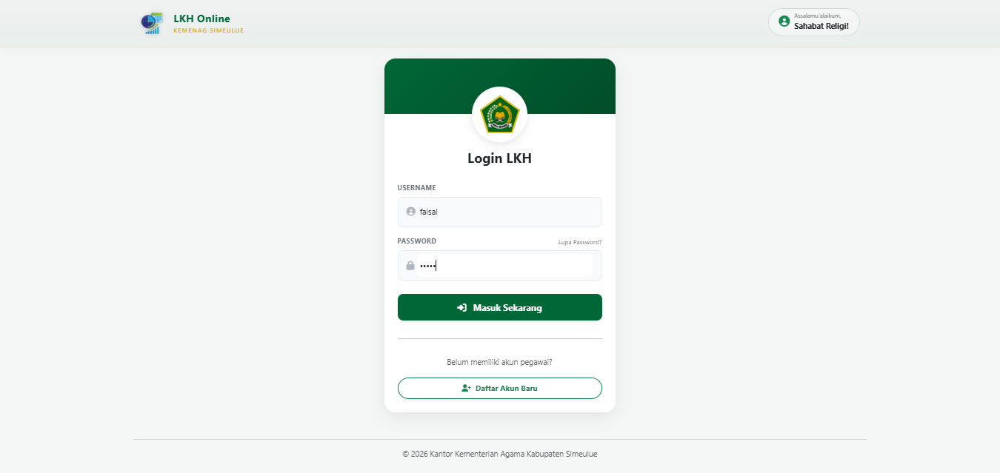
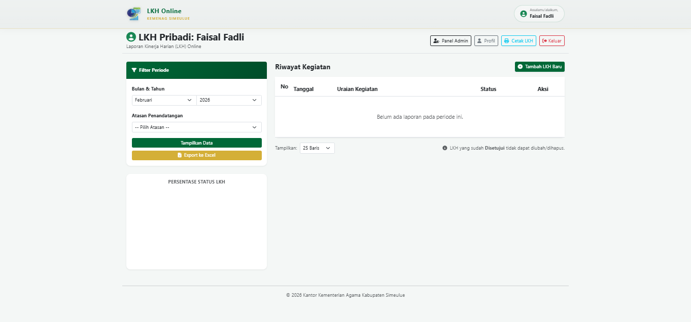
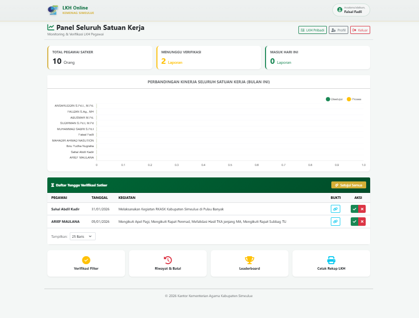
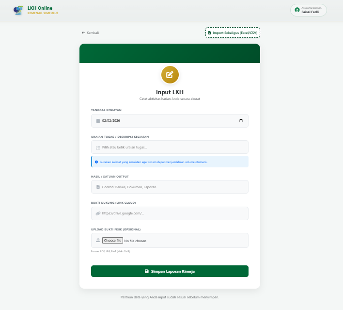

# LKH Kemenag Simeulue - Sistem Laporan Kinerja Harian

Sistem informasi berbasis web yang dirancang untuk mendigitalisasi pelaporan kinerja harian pegawai di lingkungan Kantor Kementerian Agama Kabupaten Simeulue.

👉 **Live Demo:** [https://lkh.kemenagsimeulue.cloud](https://lkh.kemenagsimeulue.cloud)

---

## 📝 Deskripsi Proyek
Aplikasi ini hadir sebagai solusi untuk menggantikan sistem pelaporan kinerja manual yang sebelumnya menggunakan kertas/dokumen fisik. Dengan **LKH Kemenag Simeulue**, proses pelaporan menjadi lebih terpusat, transparan bagi pimpinan, dan memudahkan pegawai dalam mengarsipkan aktivitas kerja mereka secara digital.

## ✨ Fitur Utama


*Tampilan Halaman Beranda*


*Tampilan Halaman Login*


*Tampilan Dashboard Pegawai*


*Tampilan Dashboard Admin*


*Tampilan Halaman Input LKH*


*Tampilan Cetak Laporan*

- **Autentikasi Keamanan:** Sistem login khusus untuk pegawai dan admin.
- **Manajemen Laporan:** Pegawai dapat menambah, mengubah, dan melihat riwayat laporan kinerja harian.
- **Dashboard Statistik:** Visualisasi ringkas mengenai status laporan yang sudah masuk.
- **Verifikasi Real-time:** Memudahkan atasan untuk memantau produktivitas bawahan secara langsung.
- **Cetak Laporan:** Fitur ekspor laporan untuk keperluan administrasi formal (Excel & Print).
- **Desain Responsif:** Optimal diakses melalui perangkat mobile (HP) maupun komputer.

## 🛠️ Teknologi yang Digunakan (Tech Stack)
Aplikasi ini dibangun dengan teknologi berikut:
- **Core:** PHP 8.x (Native)
- **Frontend:** Bootstrap 5, CSS3, & JavaScript (jQuery)
- **Database:** MySQL / MariaDB
- **Web Server:** Nginx
- **Keamanan:** SSL Encryption (Let's Encrypt) & Session Management

## 🚀 Cara Menjalankan Secara Lokal
1. **Clone repository:** ```bash
   git clone [https://github.com/faisalfadli23/lkh.kemenagsimeulue.cloud.git](https://github.com/faisalfadli23/lkh.kemenagsimeulue.cloud.git)
2. **Database:** Buat database baru di MySQL dan impor file `.sql` Anda.
3. **Konfigurasi:** Sesuaikan pengaturan koneksi database (host, user, pass) pada file konfigurasi Anda (misal: `config.php` atau file koneksi utama).
4. **Jalankan:** Letakkan folder di dalam direktori server lokal (seperti `htdocs` atau `www`) dan akses melalui browser.

---

## 📩 Kontak Pengembang
Jika Anda memiliki pertanyaan atau ingin berkolaborasi, silakan hubungi saya:

* **Nama:** Faisal Fadli
* **Email:** faisalfadli23690@gmail.com
* **Website:** [simeulue.kemenag.go.id](https://https://simeulue.kemenag.go.id/)